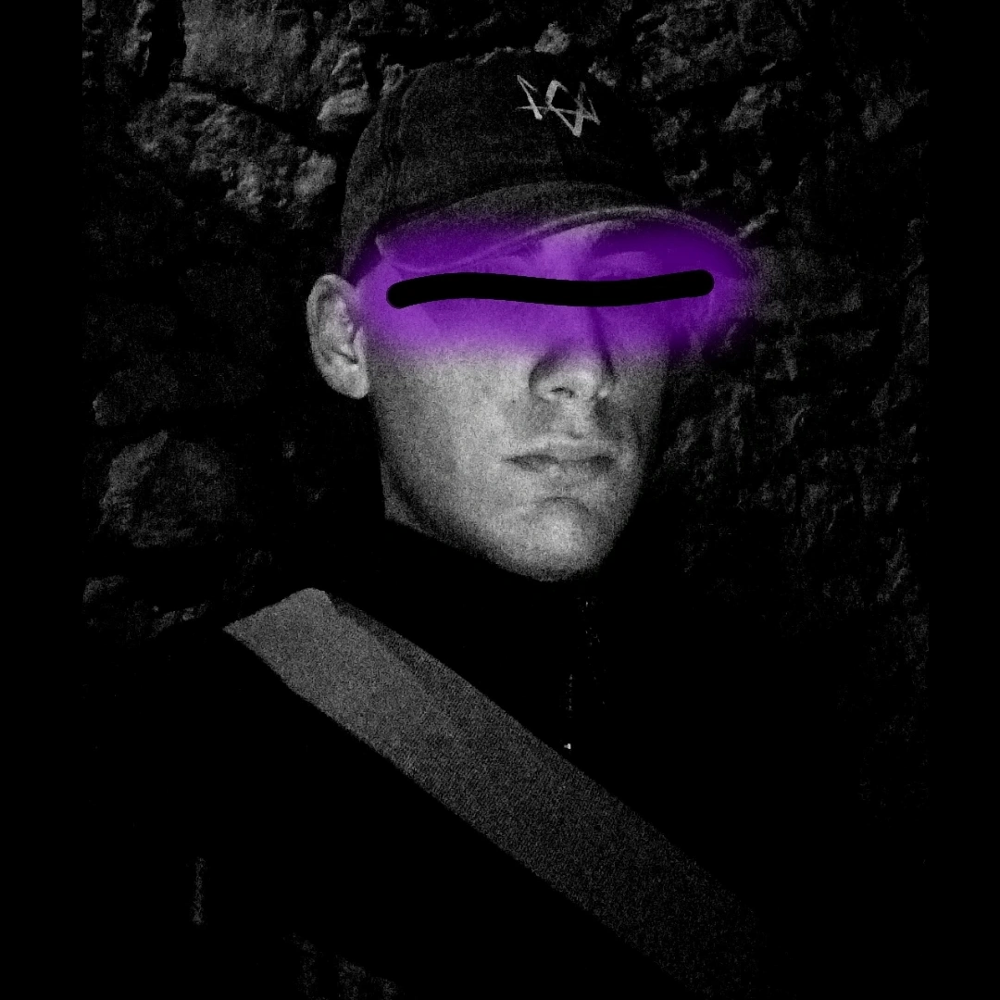

  

<h1 align="center">dedsec1121fk</h1>

  Termux • Python • Automation 
  Educational cybersecurity tooling • CLI utilities • experiments 
  Made in Greece 🇬🇷

  
  
  

---

## About me

I build **Termux-first tools** and automation-focused CLI projects — from productivity utilities and mini-games to educational cybersecurity tooling.  
Everything is designed to be **fast, practical, and beginner-friendly**, with a strong focus on **ethical & educational use**.

---

## Toolbox (what I use)

---

## What you’ll find in my repos

- **Termux automation** (setup helpers, repair wizards, backups)
- **Network utilities** (analysis helpers, link safety tools, footprint checkers)
- **Developer utilities** (file converters, site creators, helpers)
- **Mini games & experiments** (terminal-based fun projects)

---

## Portfolio

- **ODY Project** — https://ded-sec.space/ODY-Project/
- **Zepo And Xan Project** — https://ded-sec.space/Zepo-And-Xan-Project/
- **ICE Project** — https://ded-sec.space/ICE-Project/
- **KuNuPi Project** — https://ded-sec.space/KuNuPi-Project/
- **DedSec Project (Website)** — https://ded-sec.space

---

## Repositories

- **DedSec (The Official Project)** — https://github.com/dedsec1121fk/DedSec

---

## GitHub statistics (stable)

  

> This image is generated inside the repo (GitHub Actions) so it won’t randomly break when external stat services go down.

---

## Support the work

If you like what I build and want to support updates, tools, and new drops:

---
